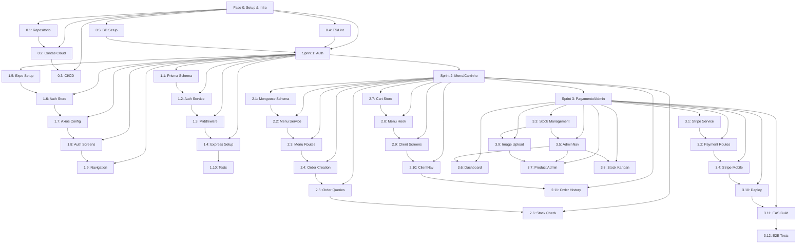

# SCOPE.md — Pasta la vista

> Mapa de execução detalhado, quebrando a ARCHITECTURE.md em fases de implementação concretas.
> Status: Planejamento | Início previsto: Semana do 7 de abril de 2026
> NUNCA UTILIZE EMOJIS

---

## Índice

1. [Fase 0: Setup & Infraestrutura](#fase-0-setup--infraestrutura)
2. [Sprint 1: Autenticação e Fundações](#sprint-1-autenticação-e-fundações)
3. [Sprint 2: Cardápio, Carrinho e Pedidos](#sprint-2-cardápio-carrinho-e-pedidos)
4. [Sprint 3: Pagamento, Admin e Estoque](#sprint-3-pagamento-admin-e-estoque)
5. [Matriz de Dependências](#matriz-de-dependências)

---

## Fase 0: Setup & Infraestrutura

> **Duração:** 2–3 dias (paralelo com Sprint 1)
> 
> Preparação de ambientes, repositórios, CI/CD e credenciais cloud.
> Nenhuma feature de produto; infraestrutura pura.

### 0.1 Repositório e Estrutura Local

**Status:** ⬜ Não iniciado  
**Dependências:** Nenhuma  
**Owner:** DevOps / Tech Lead

#### Tasks

- [x] **0.1.1** — Criar monorepo GitHub (`pasta-la-vista`) com `.gitignore` completo
  - Acrescentar `node_modules/`, `.env`, `.env.local`, `.expo/`, `dist/`, `build/`
  - Branches: `main` (prod), `develop` (staging), feature branches
  
- [x] **0.1.2** — Setup pastas base: `/api` e `/mobile` com `package.json` stubs
  - `api/package.json`: `"scripts": { "dev": "tsx watch src/app.ts", ... }`
  - `mobile/package.json`: `"scripts": { "start": "expo start", ... }`

- [ ] **0.1.3** — Criar `.env.example` em ambos os diretórios (sem valores reais)

**Acceptance Criteria:**
- [x] Repositório público no GitHub com README mínimo
- [x] `git clone` do repo + instalar deps não gera erros estruturais

---

### 0.2 Contas e Credenciais Cloud

**Status:** ⬜ Não iniciado  
**Dependências:** Nenhuma (paralelo)  
**Owner:** DevOps

#### Serviços a Provisionar

| Serviço | Tier | Credencial | Armazenar em |
|---------|------|-----------|--------------|
| Render | Free → Hobby | Token API | 1Password / GitHub Secrets |
| Supabase | Free | Database URL | GitHub Secrets (DATABASE_URL) |
| MongoDB Atlas | Free | Connection String | GitHub Secrets (MONGODB_URI) |
| Upstash Redis | Free | Redis URL | GitHub Secrets (REDIS_URL) |
| Cloudflare R2 | Free | Account ID, Keys | GitHub Secrets (R2_*) |
| Stripe | Test Mode | sk_test_, pk_test_ | GitHub Secrets + .env |
| Expo | Managed | EXPO_TOKEN | GitHub Secrets |

**Tasks:**

- [ ] **0.2.1** — Criar contas em todos os serviços acima e teste de conectividade básica
- [ ] **0.2.2** — Documentar connection strings em `.env.example` (sem valores)
- [ ] **0.2.3** — Adicionar GitHub Secrets para cada variável sensível

**Acceptance Criteria:**
- [ ] Arquivo `.env.example` sincronizado com variáveis necessárias
- [ ] GitHub Actions consegue ler secrets sem erro

---

### 0.3 CI/CD Pipeline (GitHub Actions)

**Status:** ⬜ Não iniciado  
**Dependências:** 0.2 (Secrets configurados)  
**Owner:** DevOps / Backend Lead

#### Workflows a Criar

- [ ] **0.3.1** — `.github/workflows/api-ci.yml`
  - Trigger: Push em `main` ou `develop`, ou PR com paths `api/**`
  - Jobs: `lint` → `type-check` → `test` → `deploy` (if main)
  - Lint: `npm run lint` (ESLint)
  - Type check: `tsc --noEmit`
  - Deploy: Render token deployment

- [ ] **0.3.2** — `.github/workflows/mobile-ci.yml`
  - Trigger: Push em `main` ou `develop`, ou PR com paths `mobile/**`
  - Jobs: `lint` → `type-check` → `build` (EAS preview)
  - Build: `eas build --platform android --profile preview`

- [ ] **0.3.3** — `.github/workflows/schema-sync.yml` (opcional, detecta mudanças em `prisma/schema.prisma` e avisa)

**Acceptance Criteria:**
- [ ] CI pipeline roda sem erros em primeiro commit
- [ ] Deploy manual para Render funciona via GitHub Actions

---

### 0.4 TypeScript & Linting Config

**Status:** ⬜ Não iniciado  
**Dependências:** 0.1  
**Owner:** Frontend Lead + Backend Lead

#### API

- [ ] **0.4.1** — `api/tsconfig.json` com strictNullChecks, noImplicitAny, esModuleInterop
- [ ] **0.4.2** — `api/.eslintrc.json` com regra `@typescript-eslint`
- [ ] **0.4.3** — Add scripts ao `package.json`:
  ```json
  {
    "lint": "eslint src --ext .ts",
    "type-check": "tsc --noEmit",
    "dev": "tsx watch src/app.ts",
    "build": "tsc",
    "start": "node dist/app.js"
  }
  ```

#### Mobile

- [ ] **0.4.4** — `mobile/tsconfig.json` (Expo preset via `expo/tsconfig`)
- [ ] **0.4.5** — `mobile/.eslintrc.json` com `react-native`, `react-hooks`
- [ ] **0.4.6** — `mobile/babel.config.js` com `babel-preset-expo`
- [ ] **0.4.7** — Add scripts:
  ```json
  {
    "lint": "eslint . --ext .ts,.tsx",
    "type-check": "tsc --noEmit",
    "start": "expo start",
    "build": "eas build --platform android --profile preview"
  }
  ```

**Acceptance Criteria:**
- [ ] `npm run type-check` + `npm run lint` passa sem erros em ambos os workspaces

---

### 0.5 Base de Dados — Setup Inicial

**Status:** ⬜ Não iniciado  
**Dependências:** 0.2  
**Owner:** Backend Lead

#### PostgreSQL (Supabase)

- [ ] **0.5.1** — Criar banco `pastalavista_dev` no Supabase
- [ ] **0.5.2** — Copiar `DATABASE_URL` para `.env.local` (API)

#### MongoDB (Atlas)

- [ ] **0.5.3** — Criar cluster gratuito no Atlas, database `pastalavista_dev`
- [ ] **0.5.4** — Copiar `MONGODB_URI` para `.env.local` (API)

#### Redis (Upstash)

- [ ] **0.5.5** — Criar banco Redis no Upstash
- [ ] **0.5.6** — Copiar `REDIS_URL` para `.env.local` (API)

**Acceptance Criteria:**
- [ ] Conexão de teste bem-sucedida em cada banco:
  ```bash
  # PostgreSQL
  psql "$DATABASE_URL"
  # MongoDB
  mongosh "$MONGODB_URI"
  # Redis
  redis-cli -u "$REDIS_URL" PING  # → PONG
  ```

---

## Sprint 1: Autenticação e Fundações

> **Duração:** 1 semana  
> **Dependências:** Fase 0 completa  
> **Objetivo:** Usuário consegue fazer login/registro, JWT funciona, navegação condicional por role.

### 1.1 Backend — Prisma Schema & Migrations

**Status:** ⬜ Não iniciado  
**Dependências:** 0.5 (BD's criados)  
**Owner:** Backend Lead

#### Tasks

- [ ] **1.1.1** — Criar `api/prisma/schema.prisma`
  ```prisma
  datasource db {
    provider = "postgresql"
    url      = env("DATABASE_URL")
  }

  generator client {
    provider = "prisma-client-js"
  }

  enum Role {
    CLIENT
    ADMIN
  }

  model User {
    id           String   @id @default(uuid())
    name         String
    email        String   @unique
    passwordHash String   @map("password_hash")
    role         Role     @default(CLIENT)
    phone        String?
    createdAt    DateTime @default(now()) @map("created_at")

    orders       Order[]
  }

  model Order {
    id            String      @id @default(uuid())
    userId        String      @map("user_id")
    total         Decimal     @db.Decimal(10, 2)
    status        OrderStatus @default(PENDING)
    paymentMethod String      @map("payment_method")
    paidAt        DateTime?   @map("paid_at")
    createdAt     DateTime    @default(now()) @map("created_at")

    user          User        @relation(fields: [userId], references: [id], onDelete: Cascade)
    items         OrderItem[]
    payment       Payment?
  }

  enum OrderStatus {
    PENDING
    CONFIRMED
    PREPARING
    READY
    DELIVERED
    CANCELLED
  }

  model OrderItem {
    id          String  @id @default(uuid())
    orderId     String  @map("order_id")
    productId   String  @map("product_id")
    quantity    Int
    unitPrice   Decimal @db.Decimal(10, 2) @map("unit_price")
    obs         String?

    order       Order   @relation(fields: [orderId], references: [id], onDelete: Cascade)
  }

  model Stock {
    id          String      @id @default(uuid())
    productId   String      @unique @map("product_id")
    quantity    Int
    minQuantity Int         @map("min_quantity")
    status      StockStatus @default(AVAILABLE)

    @@index([status])
  }

  enum StockStatus {
    AVAILABLE
    LOW
    OUT_OF_STOCK
  }

  model Payment {
    id              String  @id @default(uuid())
    orderId         String  @unique @map("order_id")
    stripePaymentId String  @map("stripe_payment_id")
    status          String
    amount          Decimal @db.Decimal(10, 2)

    order           Order   @relation(fields: [orderId], references: [id], onDelete: Cascade)
  }
  ```

- [ ] **1.1.2** — Executar `prisma migrate dev --name init`
  - Gera migration em `prisma/migrations/` e aplica ao banco

**Acceptance Criteria:**
- [ ] `psql "$DATABASE_URL" -c "\dt"` lista tabelas `User`, `Order`, `OrderItem`, `Stock`, `Payment`
- [ ] `prisma studio` abre UI sem erros

---

### 1.2 Backend — Auth Service

**Status:** ⬜ Não iniciado  
**Dependências:** 1.1  
**Owner:** Backend Lead

#### Estrutura: `api/src/modules/auth/`

- [ ] **1.2.1** — `auth.schema.ts` (Zod schemas)
  ```typescript
  export const RegisterSchema = z.object({
    name: z.string().min(3),
    email: z.string().email(),
    password: z.string().min(8),
  });

  export const LoginSchema = z.object({
    email: z.string().email(),
    password: z.string(),
  });

  export const RefreshSchema = z.object({
    refresh_token: z.string(),
  });
  ```

- [ ] **1.2.2** — `auth.service.ts`
  - `register(dto)`: hash senha, cria User no PG, retorna token + user
  - `login(email, password)`: valida credenciais, emite access + refresh
  - `refreshToken(refreshToken)`: valida contra Redis, emite novo access
  - `logout(userId)`: deleta session do Redis

- [ ] **1.2.3** — `auth.controller.ts`
  - `POST /auth/register`
  - `POST /auth/login`
  - `POST /auth/refresh`
  - `POST /auth/logout` (auth guard)

- [ ] **1.2.4** — `api/src/utils/jwt.ts`
  - `signAccessToken(userId, role)` → `access_token` (15min)
  - `signRefreshToken(userId)` → `refresh_token` (7d)
  - `verifyAccessToken(token)` → payload
  - `verifyRefreshToken(token)` → payload

**Acceptance Criteria:**
- [ ] `POST /auth/register { name, email, password }` cria User com senha hasheada
- [ ] `POST /auth/login { email, password }` retorna JWT válido
- [ ] Token expirado em 15min (access); refresh válido por 7d
- [ ] `POST /auth/refresh` emite novo access token

---

### 1.3 Backend — Middleware de Auth

**Status:** ⬜ Não iniciado  
**Dependências:** 1.2  
**Owner:** Backend Lead

#### Arquivo: `api/src/middleware/`

- [ ] **1.3.1** — `auth.middleware.ts`
  - Extrai Bearer token do header Authorization
  - Verifica JWT com `jwt.verify()`
  - Decoda payload (userId, role)
  - Anexa `req.user` com `{ id, role }`
  - Retorna 401 se inválido ou expirado

- [ ] **1.3.2** — `role.middleware.ts`
  - Aceita lista de roles `['ADMIN']`
  - Valida `req.user.role` contra lista
  - Retorna 403 se não autorizado

- [ ] **1.3.3** — `validate.middleware.ts`
  - Middleware factory que aceita schema Zod
  - Valida `req.body` contra schema
  - Retorna 400 com erro formatado se inválido

- [ ] **1.3.4** — `rate-limit.middleware.ts`
  - Usa `express-rate-limit`
  - 100 requisições por 15min por IP
  - Endponts públicos (auth) com limite mais alto: 20/15min

**Acceptance Criteria:**
- [ ] Requisição sem Bearer token → 401
- [ ] Requisição com token inválido → 401
- [ ] Rota admin sem role ADMIN → 403
- [ ] Body inválido contra schema → 400

---

### 1.4 Backend — Express App Setup

**Status:** ⬜ Não iniciado  
**Dependências:** 1.3  
**Owner:** Backend Lead

#### Arquivo: `api/src/app.ts`

- [ ] **1.4.1** — Criar instância Express com middleware:
  ```typescript
  const app = express();
  app.use(express.json());
  app.use(rateLimitMiddleware);
  app.use(requestLogger);
  ```

- [ ] **1.4.2** — Registrar routers
  ```typescript
  app.use('/api/v1/auth', authRouter);
  app.use('/api/v1/menu', menuRouter);
  // ... (outros virão em sprints futuros)
  ```

- [ ] **1.4.3** — Error handler global
  ```typescript
  app.use((err, req, res, next) => {
    console.error(err);
    res.status(err.status || 500).json({ message: err.message });
  });
  ```

- [ ] **1.4.4** — Health check endpoint (`GET /health`)

- [ ] **1.4.5** — Arquivo entry `api/src/index.ts`
  - Importa config de envs
  - Conecta BD's
  - Inicia servidor na porta definida

**Acceptance Criteria:**
- [ ] `npm run dev` inicia servidor sem erros
- [ ] `curl http://localhost:3333/health` retorna JSON com status

---

### 1.5 Frontend Mobile — Setup Expo

**Status:** ⬜ Não iniciado  
**Dependências:** 0.4 (TS/Lint config)  
**Owner:** Frontend Lead

#### Tasks

- [ ] **1.5.1** — Criar `mobile/app.json`
  ```json
  {
    "expo": {
      "name": "Pasta la vista",
      "slug": "pastalavista",
      "version": "0.1.0",
      "orientation": "portrait",
      "icon": "./assets/icon.png",
      "splash": { "image": "./assets/splash.png" },
      "plugins": ["expo-secure-store"],
      "ios": { "supportsTabletMode": true },
      "android": { "adaptiveIcon": { "foregroundImage": "./assets/adaptive-icon.png" } }
    }
  }
  ```

- [ ] **1.5.2** — Criar `mobile/app.config.ts` com variáveis de ambiente
  ```typescript
  export default {
    expo: {
      extra: {
        apiBaseUrl: process.env.EXPO_PUBLIC_API_BASE_URL,
        stripePk: process.env.EXPO_PUBLIC_STRIPE_PUBLISHABLE_KEY,
      },
    },
  };
  ```

- [ ] **1.5.3** — Criar `mobile/eas.json` com perfis dev/preview/prod
  ```json
  {
    "build": {
      "preview": {
        "android": { "buildType": "apk" }
      },
      "production": {
        "android": { "buildType": "aab" }
      }
    }
  }
  ```

- [ ] **1.5.4** — Instalar dependências principais:
  ```bash
  npm install expo@latest expo-router react-native-screens 
  npm install @react-navigation/{native,stack,bottom-tabs,drawer}
  npm install zustand@latest @tanstack/react-query@latest
  npm install axios react-hook-form zod
  npm install expo-secure-store react-native-mmkv-storage
  npm install react-native-stripe-sdk
  ```

**Acceptance Criteria:**
- [ ] `expo start` abre o app sem erros
- [ ] `eas build --platform android --profile preview` cria APK com sucesso (ou visualização)

---

### 1.6 Frontend Mobile — Auth Store (Zustand)

**Status:** ⬜ Não iniciado  
**Dependências:** 1.5  
**Owner:** Frontend Lead

#### Arquivo: `mobile/src/stores/auth.store.ts`

- [ ] **1.6.1** — Criar interface + store Zustand
  ```typescript
  interface User {
    id: string;
    name: string;
    email: string;
    role: 'CLIENT' | 'ADMIN';
  }

  interface AuthState {
    user: User | null;
    accessToken: string | null;
    isAuthenticated: boolean;
    setAuth: (payload) => void;
    updateToken: (token) => void;
    clearAuth: () => void;
  }
  ```

- [ ] **1.6.2** — Implementar persistência com MMKV

**Acceptance Criteria:**
- [ ] Store hidrata do MMKV ao iniciar app
- [ ] `setAuth()` persiste token e informações do usuário

---

### 1.7 Frontend Mobile — Axios Config

**Status:** ⬜ Não iniciado  
**Dependências:** 1.6  
**Owner:** Frontend Lead

#### Arquivo: `mobile/src/api/axios.ts`

- [ ] **1.7.1** — Criar instância Axios com base URL
- [ ] **1.7.2** — Request interceptor injeta Bearer token
- [ ] **1.7.3** — Response interceptor intercepta 401 e tenta refresh
- [ ] **1.7.4** — Queue de requisições aguardando refresh

**Acceptance Criteria:**
- [ ] Requisição autenticada automaticamente
- [ ] Token expirado → refresh automático → retry

---

### 1.8 Frontend Mobile — Auth Screens

**Status:** ⬜ Não iniciado  
**Dependências:** 1.7  
**Owner:** Frontend Lead

#### Telas: `mobile/src/screens/`

- [ ] **1.8.1** — `SplashScreen.tsx`
  - Exibe logo + carregamento
  - Verifica se token existe no store
  - Redireciona para login ou dashboard

- [ ] **1.8.2** — `LoginScreen.tsx`
  - Form com email + password (React Hook Form)
  - Validação Zod
  - Chama `POST /auth/login`
  - Salva token no store
  - Navega para dashboard

- [ ] **1.8.3** — `RegisterScreen.tsx`
  - Form com name + email + password + password confirm
  - Validação Zod
  - Chama `POST /auth/register`
  - Auto-login ou redireciona para login

**Acceptance Criteria:**
- [ ] Cadastro com dados válidos cria usuário e faz login
- [ ] Login com credenciais corretas funciona
- [ ] Login com credenciais erradas exibe erro
- [ ] Token persiste entre recarregamentos do app

---

### 1.9 Frontend Mobile — Navigation Stack

**Status:** ⬜ Não iniciado  
**Dependências:** 1.8  
**Owner:** Frontend Lead

#### Arquivo: `mobile/src/navigation/`

- [ ] **1.9.1** — `RootNavigator.tsx`
  - Monitora `useAuthStore` para `user` e `isAuthenticated`
  - Renderiza condicional:
    - AuthNavigator se não autenticado
    - ClientNavigator se role === CLIENT
    - AdminNavigator se role === ADMIN

- [ ] **1.9.2** — `AuthNavigator.tsx`
  - Stack com SplashScreen → LoginScreen → RegisterScreen

- [ ] **1.9.3** — `ClientNavigator.tsx` (stub, apenas estrutura)
  - Bottom Tab Navigator (virá detalhes em Sprint 2)

- [ ] **1.9.4** — `AdminNavigator.tsx` (stub)
  - Drawer Navigator (virá detalhes em Sprint 3)

- [ ] **1.9.5** — `NavigationContainer` em `App.tsx`

**Acceptance Criteria:**
- [ ] App inicia com tela de splash
- [ ] Após login com CLIENT → redireciona para ClientNavigator
- [ ] Após login com ADMIN → redireciona para AdminNavigator
- [ ] Logout → volta para AuthNavigator

---

### 1.10 Testes Backend — Auth

**Status:** ⬜ Não iniciado  
**Dependências:** 1.2, 1.3  
**Owner:** QA / Backend

#### Arquivo: `api/tests/auth.spec.ts` (Jest / Supertest)

- [ ] **1.10.1** — Testes para register
  - [x] POST /auth/register com dados válidos
  - [x] POST /auth/register com email duplicado → 409
  - [x] POST /auth/register com password fraco → 400

- [ ] **1.10.2** — Testes para login
  - [x] POST /auth/login com credenciais corretas
  - [x] POST /auth/login com credenciais erradas → 401

- [ ] **1.10.3** — Testes para refresh
  - [x] POST /auth/refresh com refresh token válido
  - [x] POST /auth/refresh com refresh token expirado → 401

**Acceptance Criteria:**
- [ ] Coverage ≥ 80% para auth service
- [ ] `npm test` passa sem erros

---

### 1.11 Integração E2E Básica

**Status:** ⬜ Não iniciado  
**Dependências:** 1.10 (opcional mas recomendado)  
**Owner:** QA

#### Task

- [ ] **1.11.1** — Criar teste E2E simples
  ```
  1. Abre app
  2. Vê tela de splash
  3. Navega para login
  4. Insere credenciais de teste
  5. Faz login com sucesso
  6. Vê tela do cliente
  7. Logout retorna para login
  ```

**Acceptance Criteria:**
- [ ] Fluxo completo de auth testado manualmente ou com Detox

---

**Fim de Sprint 1**

---

## Sprint 2: Cardápio, Carrinho e Pedidos

> **Duração:** 1 semana  
> **Dependências:** Sprint 1 completo  
> **Objetivo:** Cliente navega pelo cardápio, monta carrinho, cria pedido.

### 2.1 Backend — Mongoose Schema (Produtos)

**Status:** ⬜ Não iniciado  
**Dependências:** 0.5 (MongoDB conectado)  
**Owner:** Backend Lead

#### Arquivo: `api/src/modules/menu/product.model.ts`

- [ ] **2.1.1** — Definir schemas Mongoose
  ```typescript
  const CustomizationSchema = new Schema({
    label: { type: String, required: true },
    options: [{ type: String }],
  });

  const ProductSchema = new Schema({
    name: { type: String, required: true, index: true },
    description: { type: String },
    price: { type: Number, required: true },
    category: { type: String, required: true, index: true },
    imageUrl: { type: String },
    tags: [{ type: String }],
    customizations: [CustomizationSchema],
    active: { type: Boolean, default: true, index: true },
  }, { timestamps: true });

  export const Product = mongoose.model('products', ProductSchema);
  ```

**Acceptance Criteria:**
- [ ] Model importável sem erros
- [ ] Mongoose consegue criar collections no MongoDB

---

### 2.2 Backend — Menu Service & Cache Redis

**Status:** ⬜ Não iniciado  
**Dependências:** 2.1  
**Owner:** Backend Lead

#### Arquivo: `api/src/modules/menu/menu.service.ts`

- [ ] **2.2.1** — `getMenu()` com cache-aside
  - GET from Redis `menu:all`
  - Se miss, buscar do MongoDB
  - SET no Redis com TTL 300s (5min)

- [ ] **2.2.2** — `getProductById(id)` com cache
  - GET from Redis `menu:product:{id}`
  - Se miss, buscar do MongoDB
  - SET no Redis TTL 300s

- [ ] **2.2.3** — `getProductsByCategory(cat)` com cache
  - GET from Redis `menu:categoria:{cat}`
  - Se miss, query MongoDB
  - SET no Redis TTL 300s

- [ ] **2.2.4** — Invalidar cache ao criar/atualizar produtos
  - `updateProduct()` → DEL `menu:*`
  - `deleteProduct()` → DEL `menu:*`

**Acceptance Criteria:**
- [ ] Primeira requisição ao menu consulta MongoDB
- [ ] Segunda requisição retorna do Redis (< 10ms)
- [ ] Atualizar produto invalida cache

---

### 2.3 Backend — Menu Controller & Routes

**Status:** ⬜ Não iniciado  
**Dependências:** 2.2  
**Owner:** Backend Lead

#### Arquivo: `api/src/modules/menu/menu.controller.ts`

- [ ] **2.3.1** — GET `/api/v1/menu` (público)
  - Retorna array de produtos ativos com cache
  - Query param opcional: `?category=...`

- [ ] **2.3.2** — GET `/api/v1/menu/:id` (público)
  - Retorna detalhe de um produto

- [ ] **2.3.3** — POST `/api/v1/admin/produtos` (admin)
  - Schema Zod validation
  - Cria produto no MongoDB
  - Retorna produto criado

- [ ] **2.3.4** — PATCH `/api/v1/admin/produtos/:id` (admin)
  - Atualiza produto
  - Invalida cache

- [ ] **2.3.5** — DELETE `/api/v1/admin/produtos/:id` (admin)
  - Soft delete (seta `active: false`)
  - Invalida cache

**Acceptance Criteria:**
- [ ] GET /menu retorna lista de produtos com status 200
- [ ] POST /admin/produtos com dados válidos cria produto
- [ ] POST /admin/produtos sem role admin → 403

---

### 2.4 Backend — Cart Management (no Pedidos)

**Status:** ⬜ Não iniciado  
**Dependências:** Nenhuma (frontend-driven initially)  
**Owner:** Backend Lead

#### Task

- [ ] **2.4.1** — POST `/api/v1/pedidos` (auth: client)
  - Recebe carrinho como payload
  - Valida itens contra BD (preço, disponibilidade)
  - Cria Order no PostgreSQL com status PENDING
  - Cria OrderItems
  - Retorna Order ID

#### Schema:
```typescript
interface CreateOrderDTO {
  items: Array<{
    productId: string;
    quantity: number;
    obs?: string;
    customizations?: Record<string, string>;
  }>;
}
```

**Acceptance Criteria:**
- [ ] POST /pedidos com itens válidos cria uma order
- [ ] Preço é calculado no servidor (nunca confiar no cliente)
- [ ] Order retorna com ID para próximas etapas

---

### 2.5 Backend — Order Service & Queries

**Status:** ⬜ Não iniciado  
**Dependências:** 2.4  
**Owner:** Backend Lead

#### Arquivo: `api/src/modules/orders/order.service.ts`

- [ ] **2.5.1** — GET `/api/v1/pedidos` (admin)
  - Retorna todos os pedidos com filtro opcional por status

- [ ] **2.5.2** — GET `/api/v1/pedidos/meus` (auth: client)
  - Retorna pedidos do usuário autenticado, ordenados por data desc

- [ ] **2.5.3** — GET `/api/v1/pedidos/:id` (auth)
  - Retorna detalhe de um pedido (verificar acesso)

- [ ] **2.5.4** — PATCH `/api/v1/admin/pedidos/:id` (admin)
  - Atualiza status (PENDING → CONFIRMED → PREPARING → READY → DELIVERED)
  - Registra timestamp de cada mudança

**Acceptance Criteria:**
- [ ] GET /pedidos/meus retorna apenas pedidos do usuário
- [ ] GET /pedidos (admin) retorna todos
- [ ] PATCH status atualiza e registra histórico

---

### 2.6 Backend — Stock Check

**Status:** ⬜ Não iniciado  
**Dependências:** 2.4, 1.1  
**Owner:** Backend Lead

#### Task

- [ ] **2.6.1** — Validar estoque ao criar pedido
  - Antes de confirmar POST /pedidos:
    - Para cada item, verificar `Stock.quantity >= requested`
    - Se produto não tiver Stock entry → criar com default (999)
    - Se quantidade insuficiente → retornar 400 com produto indisponível

- [ ] **2.6.2** — Bloquear produtos com `Stock.status === OUT_OF_STOCK`
  - GET /menu não retorna produtos com status OUT_OF_STOCK
  - GET /menu/:id retorna 404 se OUT_OF_STOCK

**Acceptance Criteria:**
- [ ] Produto com quantidade 0 não aparecem no cardápio
- [ ] Tentativa de pedir produto sem estoque → 400

---

### 2.7 Frontend Mobile — Cart Store (Zustand)

**Status:** ⬜ Não iniciado  
**Dependências:** 1.5  
**Owner:** Frontend Lead

#### Arquivo: `mobile/src/stores/cart.store.ts`

- [ ] **2.7.1** — Criar store Zustand para carrinho
  ```typescript
  interface CartItem {
    productId: string;
    name: string;
    price: number;
    quantity: number;
    obs?: string;
  }

  interface CartState {
    items: CartItem[];
    addItem: (item) => void;
    removeItem: (productId) => void;
    updateQuantity: (productId, qty) => void;
    clearCart: () => void;
    total: () => number;
  }
  ```

- [ ] **2.7.2** — Cada função modifica estado localmente
- [ ] **2.7.3** — Persistir em MMKV entre sessões

**Acceptance Criteria:**
- [ ] Adicionar item → aparece no carrinho
- [ ] Remover item → desaparece
- [ ] Total é calculado corretamente

---

### 2.8 Frontend Mobile — Menu API Hook

**Status:** ⬜ Não iniciado  
**Dependências:** 1.7  
**Owner:** Frontend Lead

#### Arquivo: `mobile/src/hooks/useMenu.ts`

- [ ] **2.8.1** — Hook TanStack Query para `GET /menu`
  - staleTime: 3min
  - gcTime: 10min
  - refetchOnWindowFocus: true

#### Arquivo: `mobile/src/api/endpoints/menu.api.ts`

- [ ] **2.8.2** — Funções de chamada
  - `fetchMenu()`: GET /menu
  - `fetchProduct(id)`: GET /menu/:id
  - `fetchProductsByCategory(cat)`: GET /menu?category=...

**Acceptance Criteria:**
- [ ] Hook usa TanStack Query corretamente
- [ ] Loading/error states funcionam
- [ ] Dados são cacheados e refetched com refetchOnWindowFocus

---

### 2.9 Frontend Mobile — Screens Clientes

**Status:** ⬜ Não iniciado  
**Dependências:** 2.8, 2.7  
**Owner:** Frontend Lead

#### Telas: `mobile/src/screens/client/`

- [ ] **2.9.1** — `HomeScreen.tsx`
  - Exibe menu via `useMenu()` hook
  - FlatList com produtos
  - Filtro por categoria
  - Cada item tem botão "Adicionar"
  - Adicionar → toast de confirmação

- [ ] **2.9.2** — `ItemDetailScreen.tsx`
  - Mostra detalhe completo (imagem, descrição, customizações)
  - Permite selecionar customizações
  - Permite escolher quantidade
  - Botão "Confirmado" → add ao cart + voltar

- [ ] **2.9.3** — `CartScreen.tsx`
  - Lista itens do carrinho (store)
  - Cada item: foto, nome, qtd, preço
  - Botão "Remover"
  - Total no rodapé
  - Botão "Fazer Pedido" → navega para próxima tela

- [ ] **2.9.4** — `OrderConfirmScreen.tsx` (nova tela)
  - Confirma endereço/observações (texto livre)
  - Exibe resumo do pedido
  - Botão "Confirmar Pedido" → chama POST /pedidos
  - Se sucesso → limpa carrinho, exibe confirmação, navega para histórico

**Acceptance Criteria:**
- [ ] Cliente consegue navegar cardápio completo
- [ ] Adicionar itens ao carrinho funciona
- [ ] Criar pedido gera Order no backend

---

### 2.10 Frontend Mobile — ClientNavigator

**Status:** ⬜ Não iniciado  
**Dependências:** 2.9  
**Owner:** Frontend Lead

#### Arquivo: `mobile/src/navigation/ClientNavigator.tsx`

- [ ] **2.10.1** — Bottom Tab Navigator com abas:
  - Tab 1: **Home** (Stack: HomeScreen + ItemDetailScreen)
  - Tab 2: **Carrinho** (Stack: CartScreen + OrderConfirmScreen)
  - Tab 3: **Histórico** (Stack: OrderHistoryScreen)

- [ ] **2.10.2** — Badge no ícone de carrinho com quantidade de itens

**Acceptance Criteria:**
- [ ] Navegação entre abas funciona
- [ ] Pode navegar dentro do stack de cada aba

---

### 2.11 Frontend Mobile — Order History

**Status:** ⬜ Não iniciado  
**Dependências:** 2.10  
**Owner:** Frontend Lead

#### Arquivo: `mobile/src/screens/client/OrderHistoryScreen.tsx`

- [ ] **2.11.1** — Hook `useOrders()` para GET /pedidos/meus (auth)
- [ ] **2.11.2** — Lista pedidos com status visual (badge colorido)
- [ ] **2.11.3** — Toque no pedido → exibe detalhe em modal
- [ ] **2.11.4** — Refetch automático a cada 30s (refetchInterval)

**Acceptance Criteria:**
- [ ] Histórico exibe pedidos anteriores
- [ ] Status atualiza em tempo real (~30s)

---

### 2.12 Backend — Testes Menu & Orders

**Status:** ⬜ Não iniciado  
**Dependências:** 2.3, 2.5  
**Owner:** QA / Backend

#### Arquivo: `api/tests/menu-orders.spec.ts`

- [ ] **2.12.1** — Testes para menu
  - GET /menu retorna lista
  - GET /menu/:id retorna detalhe
  - POST /admin/produtos cria (com auth admin)
  - PATCH /admin/produtos/:id atualiza (com auth admin)

- [ ] **2.12.2** — Testes para pedidos
  - POST /pedidos cria order (com auth client)
  - GET /pedidos/meus retorna pedidos do usuário
  - GET /admin/pedidos retorna todos (com auth admin)

- [ ] **2.12.3** — Testes para estoque
  - Produto com quantidade 0 não permite pedir

**Acceptance Criteria:**
- [ ] Coverage ≥ 75% para menu e orders
- [ ] `npm test` passa

---

**Fim de Sprint 2**

---

## Sprint 3: Pagamento, Admin e Estoque

> **Duração:** 1 semana  
> **Dependências:** Sprint 2 completo  
> **Objetivo:** Fluxo de pagamento Stripe funcionando; painel admin completo.

### 3.1 Backend — Stripe Integration

**Status:** ⬜ Não iniciado  
**Dependências:** 2.4 (Orders criados)  
**Owner:** Backend Lead

#### Arquivo: `api/src/modules/payment/stripe.service.ts`

- [ ] **3.1.1** — `createPaymentIntent(orderId, amount, currency)`
  - Calcula amount no servidor (pegando Order.total)
  - Cria PaymentIntent no Stripe
  - Retorna `client_secret` para o app

- [ ] **3.1.2** — `verifyWebhookSignature(body, signature)`
  - Valida header `stripe-signature`
  - Descoda evento (payment_intent.succeeded)

- [ ] **3.1.3** — `confirmPayment(paymentIntentId)`
  - Verifica status do PI no Stripe
  - Cria registro `Payment` no PostgreSQL
  - Atualiza `Order.status → CONFIRMED`
  - Registra log no MongoDB

**Acceptance Criteria:**
- [ ] PaymentIntent criado e client_secret retornado
- [ ] Webhook recebido e validado
- [ ] Order atualizada após pagamento confirmado

---

### 3.2 Backend — Payment Controller

**Status:** ⬜ Não iniciado  
**Dependências:** 3.1  
**Owner:** Backend Lead

#### Arquivo: `api/src/modules/payment/payment.controller.ts`

- [ ] **3.2.1** — POST `/api/v1/pagamento/checkout` (auth: client)
  ```
  Recebe: { orderId }
  Retorna: { clientSecret, publishableKey }
  ```

- [ ] **3.2.2** — POST `/api/v1/pagamento/webhook` (sem auth)
  ```
  Recebe: stripe event
  Processa webhook e confirma pagamento
  Retorna: 200 OK
  ```

**Acceptance Criteria:**
- [ ] Endpoint checkout retorna clientSecret válido
- [ ] Webhook confirma pagamento corretamente

---

### 3.3 Backend — Stock Management

**Status:** ⬜ Não iniciado  
**Dependências:** 1.1  
**Owner:** Backend Lead

#### Arquivo: `api/src/modules/stock/stock.service.ts`

- [ ] **3.3.1** — GET `/api/v1/admin/estoque` (admin)
  - Lista todos os itens de estoque com status

- [ ] **3.3.2** — PATCH `/api/v1/admin/estoque/:id` (admin)
  - Atualiza quantidade
  - Recalcula `status` baseado em `minQuantity`:
    - Se qty === 0 → OUT_OF_STOCK
    - Se qty <= minQuantity → LOW
    - Se qty > minQuantity → AVAILABLE

- [ ] **3.3.3** — GET `/api/v1/admin/estoque/alertas` (admin)
  - Retorna apenas itens com status LOW ou OUT_OF_STOCK

**Acceptance Criteria:**
- [ ] PATCH estoque atualiza corretamente
- [ ] Status é recalculado automaticamente
- [ ] Alertas retorna apenas itens com problema

---

### 3.4 Frontend Mobile — Stripe Integration

**Status:** ⬜ Não iniciado  
**Dependências:** 2.9  
**Owner:** Frontend Lead

#### Arquivo: `mobile/src/screens/client/PaymentScreen.tsx`

- [ ] **3.4.1** — Tela de pagamento exibe resumo do pedido
- [ ] **3.4.2** — Botão "Pagar com Stripe"
  - Chama `POST /pagamento/checkout { orderId }`
  - Recebe `clientSecret`
  - Abre Stripe React Native SDK
  - Usuário insere dados do cartão

- [ ] **3.4.3** — Após confirmação
  - App aguarda webhook (ou polling)
  - Se sucesso → exibe tela de confirmação

#### Arquivo: `mobile/src/api/endpoints/payment.api.ts`

- [ ] **3.4.4** — `createCheckout(orderId)`: POST /pagamento/checkout

**Acceptance Criteria:**
- [ ] Stripe form abre e permite entrada de cartão
- [ ] Pagamento confirmado cria Payment no backend

---

### 3.5 Frontend Mobile — Admin Navigation

**Status:** ⬜ Não iniciado  
**Dependências:** 1.9  
**Owner:** Frontend Lead

#### Arquivo: `mobile/src/navigation/AdminNavigator.tsx`

- [ ] **3.5.1** — Drawer Navigator com drawer items:
  - Dashboard
  - Produtos
  - Estoque

**Acceptance Criteria:**
- [ ] Drawer abre e fecha
- [ ] Navegação entre telas admin funciona

---

### 3.6 Frontend Mobile — Admin Dashboard

**Status:** ⬜ Não iniciado  
**Dependências:** 3.5  
**Owner:** Frontend Lead

#### Arquivo: `mobile/src/screens/admin/DashboardScreen.tsx`

- [ ] **3.6.1** — Exibe cards com KPIs:
  - Total de pedidos (todos os tempos)
  - Pedidos hoje
  - Produtos em estoque
  - Alertas (itens com estoque baixo)

- [ ] **3.6.2** — Hook para fetchar dados: `useAdminDashboard()`

**Acceptance Criteria:**
- [ ] Dashboard carrega e exibe dados
- [ ] Atualiza a cada 1 minuto (refetchInterval)

---

### 3.7 Frontend Mobile — Admin Product Management

**Status:** ⬜ Não iniciado  
**Dependências:** 3.5  
**Owner:** Frontend Lead

#### Arquivo: `mobile/src/screens/admin/ProductListScreen.tsx`

- [ ] **3.7.1** — Lista todos os produtos
- [ ] **3.7.2** — Cada item com botões:
  - Editar
  - Deletar (soft delete)

#### Arquivo: `mobile/src/screens/admin/ProductFormScreen.tsx`

- [ ] **3.7.3** — Tela de criação/edição de produto
  - Campos: name, description, price, category, imageUrl, tags
  - Upload de imagem (multipart)
  - Salvar → POST ou PATCH conforme criação/edição

**Acceptance Criteria:**
- [ ] Admin consegue criar novo produto
- [ ] Admin consegue editar produto
- [ ] Admin consegue deletar produto (soft delete)

---

### 3.8 Frontend Mobile — Admin Stock Management

**Status:** ⬜ Não iniciado  
**Dependências:** 3.5  
**Owner:** Frontend Lead

#### Arquivo: `mobile/src/screens/admin/StockKanbanScreen.tsx`

- [ ] **3.8.1** — Exibe três colunas (Kanban):
  - AVAILABLE (verde)
  - LOW (amarelo)
  - OUT_OF_STOCK (vermelho)

- [ ] **3.8.2** — Cada card exibe:
  - Nome do produto
  - Quantidade
  - Botão para editar quantidade

- [ ] **3.8.3** — Toque em card → modal para atualizar quantidade

- [ ] **3.8.4** — Refetch automático a cada 30s

**Acceptance Criteria:**
- [ ] Kanban exibe itens nas três coluna corretas
- [ ] Drag-and-drop (opcional mas legal)
- [ ] Atualizar quantidade move item para coluna correta

---

### 3.9 Backend — Image Upload (R2)

**Status:** ⬜ Não iniciado  
**Dependências:** 0.2  
**Owner:** Backend Lead

#### Arquivo: `api/src/utils/r2.ts`

- [ ] **3.9.1** — `uploadProductImage(buffer, productId)`
  - Resize + compress com Sharp
  - Upload para R2
  - Retorna URL pública via CDN

#### Endpoint:

- [ ] **3.9.2** — POST `/api/v1/admin/produtos/:id/imagem` (admin, multipart)
  - Recebe arquivo
  - Chama `uploadProductImage()`
  - Atualiza `Product.imageUrl` no MongoDB
  - Retorna nova URL

**Acceptance Criteria:**
- [ ] Upload de imagem funciona
- [ ] Imagem é otimizada (WebP, < 100KB)
- [ ] URL é servida pelo CDN

---

### 3.10 Backend — CI/CD Deploy

**Status:** ⬜ Não iniciado  
**Dependências:** 0.3  
**Owner:** DevOps

#### Task

- [ ] **3.10.1** — Configurar Render para deploy automático
  - Conectar GitHub
  - Branch `main` → deploy automático
  - Variáveis de ambiente via Render dashboard

- [ ] **3.10.2** — Health check endpoint funciona
  - Render monitora GET /health
  - Restart automático se falhar

**Acceptance Criteria:**
- [ ] Push para `main` dispara deploy automático
- [ ] API está disponível pública em `https://api.pastalavista.Render.app`

---

### 3.11 Frontend Mobile — EAS Build

**Status:** ⬜ Não iniciado  
**Dependências:** 1.5, 3.9  
**Owner:** Frontend Lead

#### Task

- [ ] **3.11.1** — Build Android via EAS
  - Perfil `preview` → APK assinado
  - Perfil `production` → AAB (para Play Store)

- [ ] **3.11.2** — Testar APK em dispositivo físico ou emulador

**Acceptance Criteria:**
- [ ] APK instalável e funcional
- [ ] App consegue se conectar à API

---

### 3.12 Testes E2E Completo

**Status:** ⬜ Não iniciado  
**Dependências:** 3.4, 3.8  
**Owner:** QA

#### Fluxo de Teste

- [ ] **3.12.1** — Teste Cliente End-to-End
  1. Login com cliente teste
  2. Navega cardápio
  3. Adiciona itens ao carrinho
  4. Confirma pedido
  5. Faz pagamento (Stripe test mode)
  6. Vê confirmação
  7. Verifica histórico de pedidos

- [ ] **3.12.2** — Teste Admin End-to-End
  1. Login como admin
  2. Cria novo produto
  3. Upload imagem
  4. Vê produto no cardápio
  5. Atualiza estoque
  6. Vê alertas

**Acceptance Criteria:**
- [ ] Fluxo completo pode ser testado sem erros
- [ ] App não crasha em pontos críticos

---

**Fim de Sprint 3 — MVP Completo**

---

## Matriz de Dependências



---

## Tabela de Rastreamento por Status

| # | Tarefa | Sprint | Status | Owner | Bloqueadores | 
|---|--------|--------|--------|-------|--------------|
| 0.1.1 | Monorepo GitHub | Fase 0 | ⬜ | Tech Lead | - |
| 0.1.2 | Estrutura pastas | Fase 0 | ⬜ | Tech Lead | 0.1.1 |
| 0.2.1 | Contas Cloud | Fase 0 | ⬜ | DevOps | - |
| 0.3.1 | CI/CD API | Fase 0 | ⬜ | DevOps | 0.2.1 |
| 0.4.1 | TS/ESLint API | Fase 0 | ⬜ | Backend | - |
| 0.5.1 | PostgreSQL | Fase 0 | ⬜ | DevOps | 0.2.1 |
| 1.1.1 | Prisma Schema | 1 | ⬜ | Backend | 0.5.1 |
| 1.2.1 | Auth Service | 1 | ⬜ | Backend | 1.1.1 |
| 1.3.1 | Middleware | 1 | ⬜ | Backend | 1.2.1 |
| 1.4.1 | Express Setup | 1 | ⬜ | Backend | 1.3.1 |
| 1.5.1 | Expo Setup | 1 | ⬜ | Frontend | 0.4.2 |
| 1.6.1 | Auth Store | 1 | ⬜ | Frontend | 1.5.1 |
| 1.7.1 | Axios Config | 1 | ⬜ | Frontend | 1.6.1 |
| 1.8.1 | Auth Screens | 1 | ⬜ | Frontend | 1.7.1 |
| 1.9.1 | RootNavigator | 1 | ⬜ | Frontend | 1.8.1 |
| 2.1.1 | Mongoose Schema | 2 | ⬜ | Backend | 0.5.2 |
| 2.2.1 | Menu Service | 2 | ⬜ | Backend | 2.1.1 |
| 2.3.1 | Menu Routes | 2 | ⬜ | Backend | 2.2.1 |
| 2.4.1 | Order Creation | 2 | ⬜ | Backend | 1.1.1 |
| 2.7.1 | Cart Store | 2 | ⬜ | Frontend | 1.5.1 |
| 2.8.1 | useMenu Hook | 2 | ⬜ | Frontend | 1.7.1 |
| 2.9.1 | HomeScreen | 2 | ⬜ | Frontend | 2.8.1 |
| 3.1.1 | Stripe Service | 3 | ⬜ | Backend | 2.4.1 |
| 3.2.1 | Payment Routes | 3 | ⬜ | Backend | 3.1.1 |
| 3.3.1 | Stock Mgmt | 3 | ⬜ | Backend | 1.1.1 |
| 3.4.1 | Stripe Mobile | 3 | ⬜ | Frontend | 2.9.1 |
| 3.8.1 | Stock Kanban | 3 | ⬜ | Frontend | 3.3.1 |
| 3.10.1 | Deploy Render | 3 | ⬜ | DevOps | 1.4.1 |
| 3.11.1 | EAS Build | 3 | ⬜ | Frontend | 1.5.1 |
| 3.12.1 | E2E Tests | 3 | ⬜ | QA | 3.11.1 |

---

## Notas de Planejamento

### Sugestões de Paralelização

1. **Fase 0 (primeiros 2–3 dias):**
   - DevOps: Infraestrutura (0.1–0.3, 0.5)
   - Backend: TS/ESLint config (0.4.1–0.4.3)
   - Frontend: TS/ESLint + Expo setup (0.4.4–1.5)

2. **Sprint 1 (dias 4–8):**
   - Backend: Tasks 1.1–1.4 (sequenciais, início rápido)
   - Frontend: Tasks 1.5–1.9 (paralelo após 1.5)
   - QA: Testes 1.10–1.11 (após 1.4)

3. **Sprint 2 (dias 9–15):**
   - Backend: 2.1–2.6 (sequencial)
   - Frontend: 2.7–2.11 (paralelo após 2.8 e 1.9)

4. **Sprint 3 (dias 16–22):**
   - Backend: 3.1–3.3 (sequencial)
   - Frontend: 3.4–3.8 (paralelo após 3.1)
   - DevOps: 3.10 (paralelo)
   - Frontend: 3.11 EAS (após QA funcionar)

### Critérios de Aceitação Globais (TODO)

- [ ] Código revisado em PR (≥1 aprovação)
- [ ] TypeScript sem erros (`tsc --noEmit`)
- [ ] ESLint sem warnings críticos
- [ ] Tests passando (coverage ≥75% para backend)
- [ ] CI/CD verde no GitHub Actions
- [ ] Documentação de APIs atualizada (via Swagger)

---

**Documento vivo.** Atualizar a cada reunião de planning conforme evolução do projeto.

---

*Última revisão: 7 de abril de 2026*
